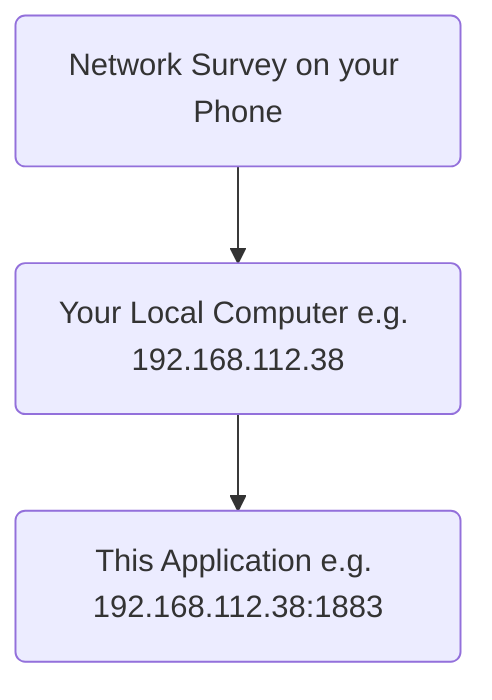
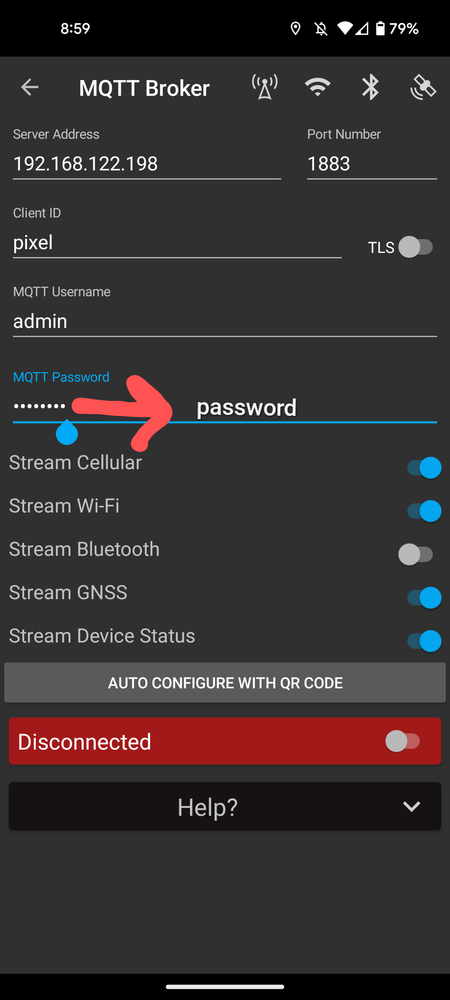

# DFP Lite

A small local runtime of DFP using Network Survey, Mongo, MQTT, and Node-Red.

### How does this work?

1. Network Survey should be running locally on your phone
2. You need your phone to be connected to your computer's network
    - I use a Hotspot to achieve this (e.g. start hotspot on phone and connect my local computer to the hotspot)
    - If you need to connect to your local network (not a hotspot), you'll need to open up the port 1883 for the MQTT Broker. This is how to do this on Windows:
        - Navigate to Control Panel, System and Security and Windows Firewall.
        - Select Advanced settings and highlight Inbound Rules in the left pane.
        - Right click Inbound Rules and select New Rule.
        - Select a port rule
        - Add the port 1883 to open
        - Add the protocol (TCP or UDP)
        - Select "Allow the connection"
        - I selected "private" networks for my rule
        - Then I just named it MQTT Port
3. Run this application
4. Point your Network Survey MQTT connection at your computer's IP address and the port 1883



### How to run the app

1. Start the application on your computer

```bash
# If you're daring, you can just try my ./start.sh script 
# in the root of the repo. If it fails, just follow the manual steps.

# Install the node dependecies for NodeRed
$ cd node-red/data
$ npm install

# Install the node dependecies for the web application
$ cd reveal-lite
$ npm install

# Run docker-compose to start up the application
$ cd ../../
$ docker-compose up
```

2. Setup your local Network Survey application
<table>
    <tr>
        <td>Server Address</td>
        <td>The computer's IP (e.g. 192.168.122.198)</td>
    </tr>
    <tr>
        <td>Port Number</td>
        <td>1883</td>
    </tr>
    <tr>
        <td>MQTT Username</td>
        <td>admin</td>
    </tr>
    <tr>
        <td>MQTT Password</td>
        <td>password</td>
    </tr>
</table>



3. Then hit the "Disconnected" toggle to connect to the MQTT service. It should be pretty quick and should result in a green "Connected"

4. After it has connected, you can roughly test if it's working by going to  http://localhost:1880/network-survey
    - Your should see some JSON data from Network Survey coming in

5. You can go to http://localhost:3000 to review a sample UI we have created to display the data

### Debug

You should be able to see JSON if you visit http://localhost:1880/network-survey. If you are not seeing JSON, check the Node-Red instance at http://localhost:1880 to make sure the `flow` is setup correctly (Network Survey Flow)

### Want to manage the data yourself

Checkout Node-Red on http://localhost:1880 to make your own flows with the data. `Network Survey Flow`. That flow shows three things:
1. How to connect to the MQTT broker
2. How to convert records to JSON for an HTTP endpoint
3. How to store records into a MongoDB database 